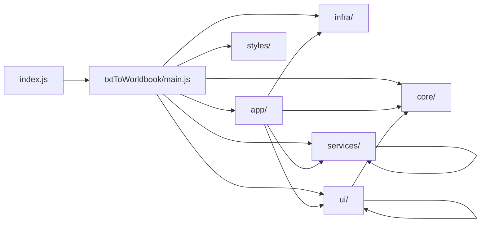

# WestWorld 项目地图（CodeGraph 版）

基于 `.codegraph/codegraph.db` 生成；已于 2026-08-30 执行 `codegraph index --force` 全量重建。

当前图谱规模：`90 files` / `1098 nodes` / `3129 edges`。

> 索引范围：CodeGraph 当前分析 JavaScript/ECMAScript 模块（`.js` / `.mjs`）。根目录的 HTML、CSS、JSON、TXT、Markdown 和 `.codegraph` 数据库不计入上述图谱统计；它们仍属于项目交付物，见文末的结构备注。

## 1. 入口链

- `index.js`：SillyTavern 扩展壳入口，负责挂载面板、注册导演钩子、加载 `txtToWorldbook/main.js`
- `txtToWorldbook/main.js`：`txtToWorldbook` 模块的装配根，串起 `core / infra / services / app / ui`

## 2. 分层职责

- `root`：`index.js`、`manifest.json`、页面模板与静态资源
- `app/`：装配层，组装服务、UI 和运行时桥接
- `core/`：常量、状态、运行时、日志、工具
- `infra/`：API 调用、内存历史库、弹窗工厂、事件委派
- `services/`：业务逻辑层，负责解析、处理、导入导出、合并、导演、修复等
- `ui/`：视图与弹窗层
- `styles/`：独立样式文件

## 3. 关键装配链

- `app/createCoreServices.js`：装配 `worldbook / prompt / parser / token / export / reroll`
- `app/createFeatureServices.js`：装配 `import / export / merge / replace / search / help / history`
- `app/createShellRuntime.js`：装配 `file import / category / entry config / modal lifecycle`
- `app/createRuntimeBridges.js`、`app/createMainBindings.js`、`app/publicApi.js`：把模块能力桥接回 `index.js`
- `ui/createUiHelpers.js`：UI 聚合入口，集中组织各个视图与面板
- `ui/createWorldbookViewRuntime.js`：包裹 `worldbookView.js`
- `src/domain/chapter/chapterDetection.js`、`chapterOpening.js`：章节边界识别与原文开头展示的纯领域函数

## 4. 热点文件

按节点密度看，最“厚”的文件是：

- `txtToWorldbook/services/processingService.js`
- `txtToWorldbook/services/directorService.js`
- `txtToWorldbook/ui/chapterExperienceView.js`
- `index.js`
- `txtToWorldbook/main.js`
- `txtToWorldbook/ui/settingsPanel.js`

这几处通常也是理解流程、定位改动影响面的第一站。

## 5. 依赖特征

- `main.js` 是全局总装配点，向下连接 `app / core / infra / services / ui`
- `app` 层主要向 `services` 和 `ui` 发散
- `services` 层内部最核心的共享点是 `nameNormalizationService.js`
- `ui` 层以 `createUiHelpers.js` 为聚合中枢，负责把分散视图收拢起来

## 6. 当前结构评估（基于 2026-08-30 图谱）

结论：**目录分层基本清楚，但内部仍处在“单体拆分后的过渡态”，存在明显耦合和局部冗余；不建议继续横向增加模块，应该先收敛边界。**

### 6.1 主要复杂度来源

- `txtToWorldbook/main.js` 仍是 1,419 行的全局装配根，包含 36 个静态导入、全局可变绑定、兼容别名和大量委托函数。它本身不再承载全部业务，但仍是所有服务/UI 的接线板，修改影响面大。
- `services/processingService.js`（3,549 行）、`services/directorService.js`（2,193 行）、`ui/chapterExperienceView.js`（1,495 行）是业务热点；前三个合计约 7,237 行。前十个最大文件合计 15,736 行，占 JS/MJS 总行数 31,132 行的约 51%，说明复杂度高度集中。
- `app/createCoreServices.js`、`createFeatureServices.js`、`createShellRuntime.js` 通过超大的 `deps` 对象进行依赖注入，虽然可测试性较好，但当前已经形成“参数搬运层”：大量函数只是在 main 与服务之间转发，阅读和追踪成本高。

### 6.2 可确认的冗余/重复

- 领域规范化逻辑曾在多处重复：目前 `normalizeSplitRule` 仍由 `directorService.js`、`processingService.js`、`taskStateService.js`、`chapterExperienceView.js` 保留薄包装，但实际规则已集中到 `src/domain/chapter/splitTypes.js`；`normalizeSelfCheck` 仍在三个文件各自实现，下一步可继续收敛。
- 通用显示/解析工具仍有重复：`escapeHtml` 分布在 `replaceAndCleanService.js`、`chapterExperienceView.js`、`renderer.js`、`settingsPanel.js`。章节识别逻辑已抽取到 `src/domain/chapter/chapterDetection.js`，由 `fileImportService.js` 和 `chapterRegexView.js` 共用，避免两套实现继续漂移。
- 状态操作重复：`getWorldbookStatus` / `setWorldbookStatus` 在 `repairService.js` 与 `rerollService.js` 重复；`saveCategoryLightSettings`、`setEntryConfig`、`getEntryConfig`、`getCategoryBaseOrder` 等在 `main.js` 还保留一层同名包装。后者多为兼容委托，不是独立业务，但会制造“多个真相来源”的错觉。
- 模态框和设置存在多级 facade/placeholder：`createMainBindings.js`、`runtimeActionsFacade.js`、`modalRuntimeFacade.js`、`editorActionsFacade.js`、`settingsActionsFacade.js` 同时存在。它们解决了拆分期间的生命周期问题，但长期看属于过渡层，应在 API 稳定后合并或删除。

### 6.3 边界不一致与仓库级冗余

- `src/domain/chapter/splitTypes.js` 是唯一独立 domain 模块，实际业务规范化仍散落在 services/UI；当前 `src` 更像局部抽取区，而不是完整领域层。
- 样式有三套来源：根目录 `style.css`、`ui/modalStyles.js` 内嵌约 2,380 行 CSS、`txtToWorldbook/styles/modal.css` 仍是 Stage A 占位文件。后者基本没有运行时价值，前两者也缺少明确的归属规则。
- 根目录同时放置运行入口、演示页面、预设 JSON、需求/流程文档和 Git 操作记录；`正则美化/` 下的 8 个大文件更像示例/素材，而不是运行时代码。交付代码、样例资源和项目文档尚未分目录管理。
- 当前没有 `package.json` 或统一测试/构建配置；只有 `tests/domain/chapter/splitTypes.test.mjs` 一组测试，代码图谱能索引到测试文件，但无法反映完整的回归覆盖率。

### 6.4 建议的收敛顺序

1. 继续扩展 `src/domain`（章节、状态、世界书条目）唯一规范化入口，逐步删除 services/UI 中只做转发的同名包装。
2. 将 `main.js` 限定为启动与公开 API，逐步把委托包装迁移到明确的 bridge 模块，并减少 placeholder/compatibility alias 的存活范围。
3. 把 `processingService`、`directorService`、`chapterExperienceView` 按“解析/状态/执行/渲染”继续拆分；每次拆分后补对应单元测试。
4. 统一 CSS 入口，决定采用外部 `styles/` 还是运行时注入，删除占位的 `txtToWorldbook/styles/modal.css` 或真正接入它。
5. 将演示/预设/需求文档移入 `examples/`、`docs/`、`assets/` 等目录，并补充最小的 `package.json` 测试脚本，降低根目录噪声。

## 7. 推荐读图顺序

1. 先看 `index.js`
2. 再看 `txtToWorldbook/main.js`
3. 然后顺着 `app/` 的三个装配文件进入 `services/` 和 `ui/`
4. 最后按功能去追 `processingService.js`、`directorService.js`、`chapterExperienceView.js`
