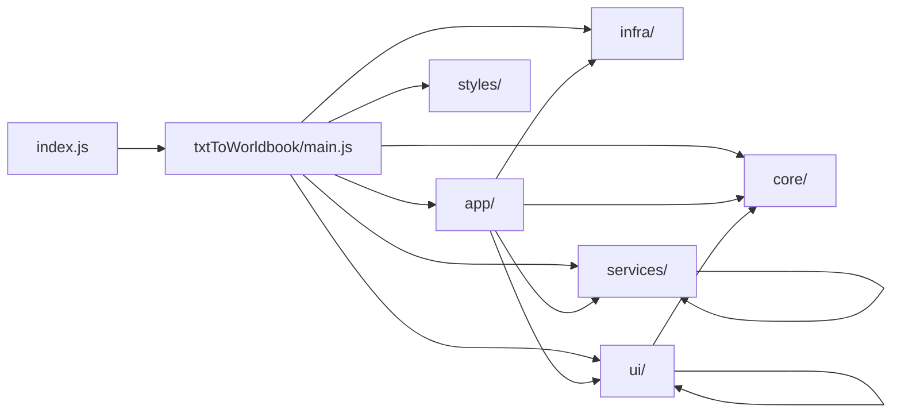

# StoryWeaver 项目地图（CodeGraph 版）

基于 `.codegraph/codegraph.db` 生成。

当前图谱规模：`83 files` / `1053 nodes` / `2928 edges`。

## 1. 入口链

- `index.js`：SillyTavern 扩展壳入口，负责挂载面板、注册导演钩子、加载 `txtToWorldbook/main.js`
- `txtToWorldbook/main.js`：`txtToWorldbook` 模块的装配根，串起 `core / infra / services / app / ui`

## 2. 分层职责

- `root`：`index.js`、`manifest.json`、页面模板与静态资源
- `app/`：装配层，组装服务、UI 和运行时桥接
- `core/`：常量、状态、运行时、日志、工具
- `infra/`：API 调用、内存历史库、弹窗工厂、事件委派
- `services/`：业务逻辑层，负责解析、处理、导入导出、合并、导演、修复等
- `ui/`：视图与弹窗层
- `styles/`：独立样式文件

## 3. 关键装配链

- `app/createCoreServices.js`：装配 `worldbook / prompt / parser / token / export / reroll`
- `app/createFeatureServices.js`：装配 `import / export / merge / replace / search / help / history`
- `app/createShellRuntime.js`：装配 `file import / category / entry config / modal lifecycle`
- `app/createRuntimeBridges.js`、`app/createMainBindings.js`、`app/publicApi.js`：把模块能力桥接回 `index.js`
- `ui/createUiHelpers.js`：UI 聚合入口，集中组织各个视图与面板
- `ui/createWorldbookViewRuntime.js`：包裹 `worldbookView.js`

## 4. 热点文件

按节点密度看，最“厚”的文件是：

- `txtToWorldbook/services/processingService.js`
- `txtToWorldbook/services/directorService.js`
- `txtToWorldbook/ui/chapterExperienceView.js`
- `index.js`
- `txtToWorldbook/main.js`
- `txtToWorldbook/ui/settingsPanel.js`

这几处通常也是理解流程、定位改动影响面的第一站。

## 5. 依赖特征

- `main.js` 是全局总装配点，向下连接 `app / core / infra / services / ui`
- `app` 层主要向 `services` 和 `ui` 发散
- `services` 层内部最核心的共享点是 `nameNormalizationService.js`
- `ui` 层以 `createUiHelpers.js` 为聚合中枢，负责把分散视图收拢起来

## 6. 推荐读图顺序

1. 先看 `index.js`
2. 再看 `txtToWorldbook/main.js`
3. 然后顺着 `app/` 的三个装配文件进入 `services/` 和 `ui/`
4. 最后按功能去追 `processingService.js`、`directorService.js`、`chapterExperienceView.js`

